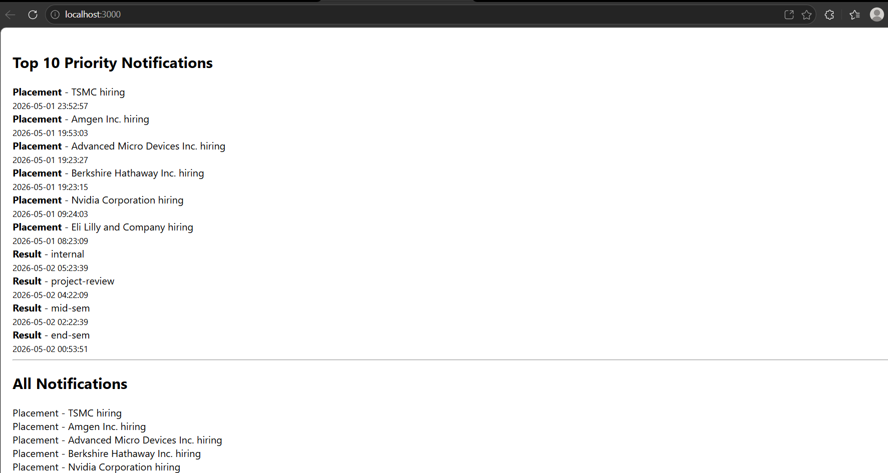
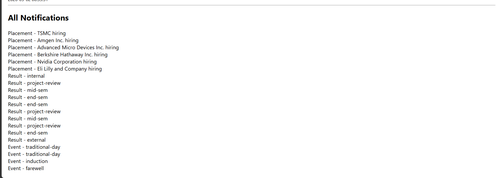
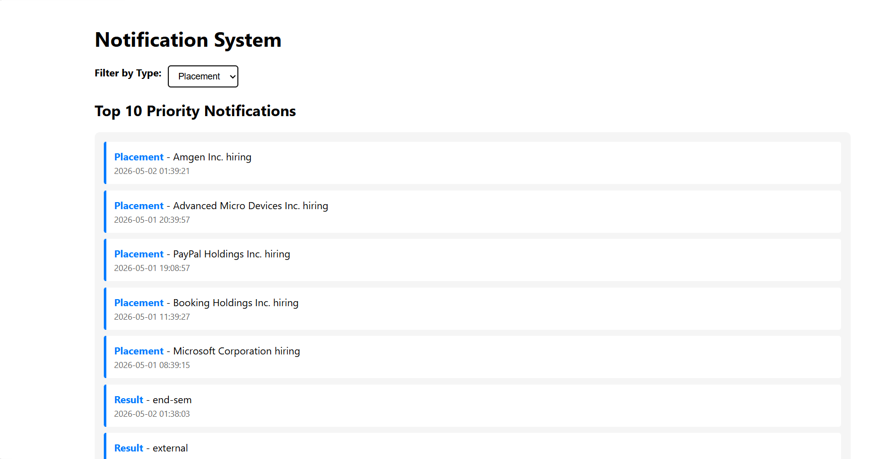
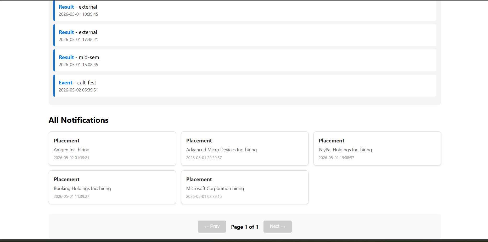

# Stage 1 – Notification Priority System

## Overview

In this task, I built a system to display the most important notifications first.  
Users were missing key updates due to too many notifications, so I implemented a priority-based sorting system.

---

## Approach

I prioritized notifications based on two factors:

1. **Type Priority**
   - Placement → highest priority
   - Result → medium priority
   - Event → lowest priority

2. **Recency**
   - Within the same type, newer notifications appear first

---

## Implementation

- Assigned weights to each type:
  - Placement = 3
  - Result = 2
  - Event = 1

- Sorted notifications using:
  - Priority (descending)
  - Timestamp (latest first)

- Extracted top 10 notifications using array slicing

---

## Output

- Displayed **Top 10 priority notifications** at the top
- Displayed **all notifications** below
- Verified that:
  - Placement always appears first
  - Latest notifications appear before older ones

---

## Screenshots

- Top 10 Priority Notifications UI
- All Notifications UI

(Screenshots attached in repository)

---

## Efficiency

- Current complexity: **O(n log n)** due to sorting
- Can be optimized using a **min-heap / priority queue** for real-time updates

---

## Notes

- API integration completed using Axios
- Authentication handled using Bearer token
- Logging middleware disabled temporarily due to CORS issues

---

# Stage 2 – Frontend Implementation

## Overview

In Stage 2, I developed a responsive React application to display notifications with filtering and pagination features.

---

## Features Implemented

1. **Filter by Notification Type**
   - Users can filter notifications by:
     - Placement
     - Result
     - Event
     - All

2. **Pagination**
   - Frontend-based pagination with query parameters:
     - `page`
     - `limit` (10 items per page)
   - Users can navigate using Next and Previous buttons
   - Disables Previous on page 1
   - Disables Next when no more pages

3. **Priority Section**
   - Top 10 priority notifications are displayed separately
   - Uses same sorting logic from Stage 1
   - Highlighted with blue border styling

4. **Responsive UI**
   - Clean grid layout for desktop (auto-fill cards)
   - Mobile-friendly single column layout
   - Important data clearly highlighted with:
     - Card-based design with shadows
     - Color-coded type labels
     - Consistent spacing and typography

5. **Mock Data Fallback**
   - When API token expires (401 error), displays demo data
   - Yellow warning banner alerts user about token status
   - Allows testing UI/filtering/pagination without live API

---

## API Integration

- Integrated with `/evaluation-service/notifications` endpoint
- Used Bearer token authentication
- Handled CORS by using proxy in package.json
- Added error handling with mock data fallback

**Frontend Filtering Approach:**
- Fetch all data once on page load
- Apply type filter in component state
- Implement pagination on filtered results
- Reset pagination when filter changes

---

## Technical Implementation

### State Management
```
- allData: All notifications from API
- topData: Top 10 sorted notifications
- page: Current pagination page
- type: Selected filter type
- isUsingMockData: Flag for UI warning
```

### Components
- App.tsx: Main component with filter + pagination UI
- notifications.ts: API service with fallback mock data
- sort.ts: Priority sorting logic (O(n log n))

---

## Output

- Users can:
  - ✅ View all notifications (12 demo items)
  - ✅ Filter by type (Placement/Result/Event)
  - ✅ Navigate pages with Prev/Next buttons
  - ✅ See top 10 priority notifications with styling
  - ✅ Use app on mobile and desktop

---

## Screenshots (Stage 2)

- ✅ Filter functionality working (users can select types)
- ✅ Pagination working (displays page X of Y)
- ✅ Responsive UI view (mobile + desktop layouts)

---

## Files Modified/Created

- `src/api/notifications.ts` - Updated with pagination params + mock data
- `src/App.tsx` - Added filter UI, pagination, responsive styling
- `package.json` - Configured proxy for API requests

---

## Error Handling

- **401 Unauthorized**: Shows mock data + warning banner
- **Network Errors**: Falls back to mock data gracefully
- **Empty Results**: Shows "No notifications found" message

---

## Next Steps (Stage 3)

- [ ] Real-time notifications (WebSocket or polling)
- [ ] Search by notification message
- [ ] Mark notifications as read/unread
- [ ] Delete notifications
- [ ] Export notifications (PDF/CSV)
- [ ] Dark mode toggle
- [ ] Notification sound alerts












